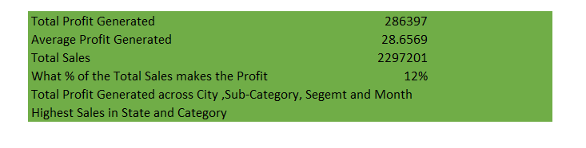
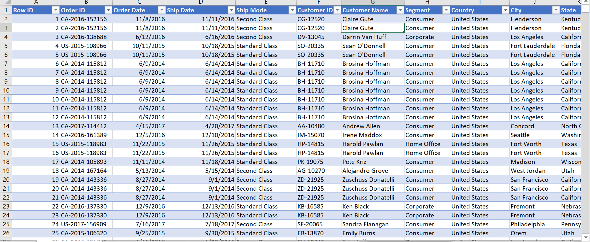
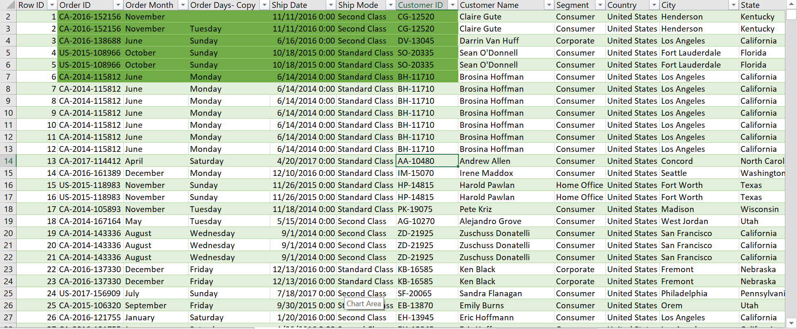
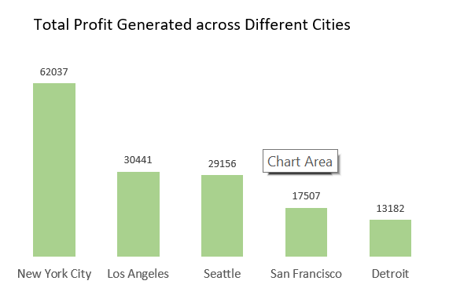
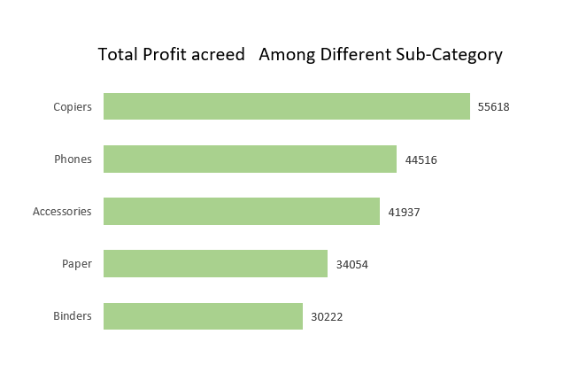
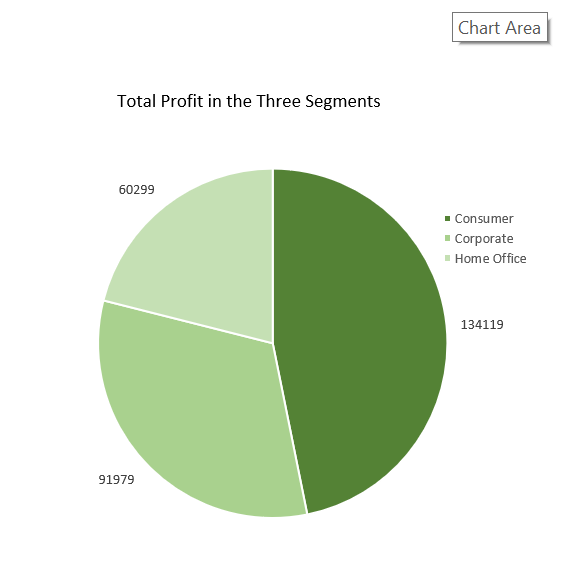

##  Super-Store-Project 
##  INTRODUCTION
### Business Problem of U.S Super Store  
The data of a super store in the United State was provided for us to clean, analyze, visualize and come
 up with six questions indicating key perfomace index of the different columns.
 
## TASK QUESTION  
1. What is the Total Profit Generated and Average Profit Generated 
2. What is the Total Sales 
3. What percentage of the Total Sales makes the profit
4. Total Profit Generated across Cities, Sub-Category and Segments 
5  Days and Months in  which Highest Profit are recorded

##  SKILLS ADOPTED 

-  Power Qury Editor
-  Filtering & Sorting
-  Aggregate Function
-  Pivot Table 
-  Pivot Chart
  
 ## SOLUTION TO TASK
 The power qury editor was used to clean the data,remove duplicates and Transform 
    and change the date function.

 1.   To calculate the total profit the ** SUM FUNCTION** was explored and The 
      **AVERAGE FUNCTION** to calculate the average profit.

2.  The total sales calculated using the **SUM FUNCTION** on the sales column.

3. The Percentage of sales that makes profit involes diving the total sum of sales
    0ver the total sum of profit  which is formatted to percentage 

5. Question 4 and 5 were answered using the pivot table and pivot chart.

  
  
  ##  RAW TABLE
  

## TRANSFORMED TABLE

The column chart shows total profit across the different cities with New york having the Highest profit while Detroit generated the least profit.

The Bar chat indicated the Total Profit Generated across the differnt sub-category the copiers had the most profit with binders returning the lowest.

 
